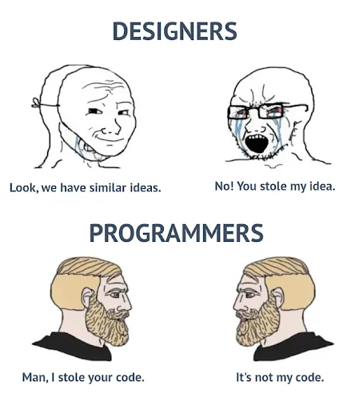

>[!IMPORTANT]
>
>**We are currently in Beta Test**

Copyright&copy; 2024, Ivy Ho
# 2025-02-25
1. Add color code
2. Add functional bug type in bug template
3. Remove all space in branch and found cl
# 2025-02-05
1. Compare translation and Highlight color code can switch smoothly now
2. The compare translation and highlight color code button also added css color
# 2025-02-01
1. Separate Diff Match Patch module from highlight_translation_difference.js
# 2025-01-31
1. Add additional label for text overlap and truncation
2. Add tooltip for buttons and textarea for xloc tab
3. Fix typo(source ID -> resource ID)
4. Color code converter can convert styles other than color code
# 2025-01-26
1. Change the way applying theme
# 2025-01-23
1. Show tooltip when user enter username in wrong format
2. Fix first install UI error
# 2025-01-16
1. Auto detect branch and fill in template
# 2025-01-05
1. Add fix version in new bug tab
2. Summary text area will grow if user input more than 1 line
3. Remove profile tab, add a setting button on the bottom left corner instead
4. Add note in 
5. Update UI
# 2024-12-22
1. Fix blank label bug
# 2024-12-21
1. Mistake-proofing for ALL label in new bug tab
2. Save label information in localstorage and selected labels won't be disappeared if the extension window closed
# 2024-12-15
1. Fix translation contrast in xloc tab when user search translaion and xloc will autimatically highlight the text, I remove it to keep translation contrast work
2. If user enter whole build number in found cl, it will only extract the number part
3. Add theme logo picture for some theme
# 2024-12-14
1. Mistake-proofing for label(issue type 2) in new bug tab
2. What's new only show when user need to update
# 2024-12-13
1. Finish taco theme
2. Make the selection or dropdown same length in profile tab
# 2024-12-06
1. Fix Translation Contrast unhighlight bug
2. Add click copy button feedback
# 2024-12-05
1. Add what's new in profile tab
2. Fix button border and border-radius will change after click
3. If #color_code_string doesn't contain color code, it will notice user but still present the string
4. Emoji code now has a separate json file as color code
# 2024-12-04
1. Expand the text area in xloc tab
2. Update tab order to New bug > Naming > XLOC > Profile
3. Fix typo (Grammer -> Grammar) and use "/" instead of "-" in summary if but type 2 is Spelling&Grammar
4. Remove "All" in Loc Language if logging a multi-language bug
5. Remove all front and end space for found CL in new bug tab
6. Fix Regression Lock issue
7. read_bug_data.js won't return filename now.
# 2024-11-29
1. Fix translation contrast bug(Create a pointer to prevent finding wrong text to highlight)
2. Add regression lock at file naming tab
# 2024-11-28
1. Implement new way to retrieve bug data without delay
2. Bug description title set to bold
# 2024-11-27
1. Use promise instead of recursive callback to improve readability and prevent callback hell
# 2024-11-26
1. Fix New bug tab Resource IDs default 0px height issue
2. Add light background selection for xloc color code translation
3. Fix New bug tab WZ level error(typo)
4. If user already up to date, reopen the update notice
# 2024-11-21
1. Add Location and Resource IDs textarea in New Bug tab
2. Set all textarea max-height to 250 px
3. Specific xloc type (Linebooks or Non-Linebooks) in bug description
# 2024-11-20
1. If user didn't select any Game Mode label, the default type would be **General**
2. The extension will now check the update itself
# 2024-11-14
1. Add multilanguage check box and corresponding features
2. Remove summary input history
3. Add color code and icon
# 2024-11-11
1. Fix type (email -> username)
# 2024-11-10
1. Implement different action required base on issue type
2. Safety issus now be consider as issue type 2, and if safety issue and other issue are selected at the same time, the issue type 2 will be the safety issue(higher priority)
3. File name in File Naming tab will default select your Loc Language(if applicable)
# 2024-11-08
1. Fix bug (Seasonal label is always Loc_S1)
2. Edit action required section in New Bug tab
# 2024-11-07
1. Rename **Label** tab to **New Bug** tab
2. Add safety issue label in New Bug tab
3. New Bug tab can generate a jira query string to create new bug
4. Add profile tab which can let user input their language and jira username
5. Remove fontawesome to reduce extension size
6. Remove Regression Tab
# 2024-11-05 🎂
1. Remove comment tab
2. Change Translation contrast highlight color to Light/Dark Green
3. Fix label typo and incorrect issue type
4. Add Text/Subtitle_Missing, Subtitle_Mismatch, Loc_Language, Loc_Cerberus and telescope specific labels
# 2024-11-04
1. Add translation contrast button in Xloc tab
2. If read_bug_data.js cannot read bug data, it will automatically retry in .5 second
3. Add **Loc_Text_Spelling_Grammer** label in label tab
4. Replace "/" to space in file name textarea
# 2024-10-25
1. When user click click Loc_Text or Loc_Subtitle or Loc_Audio, the corresponding tags will show up
2. Add "CLEAR Selected Tags" button
# 2024-10-22
1. Add Report Error link, which will redirect to Ivy's slack profile
2. Adjust pop up width (Enlarge)
# 2024-10-20
New evolution of the codes but the UI become more ugly :painsmile:
1. Stop keep calling content script every 1 sec, all action will be taken when the pop up window open
2. Add tag tab for adding tags when logging a bug
3. Add more color code, especially from Jupiter color code
4. Enlarge the File name text area in File Naming tab
5. Add more platform and LNG in Comment tab

## Note
local storage snapshot `chrome.storage.local.get(console.log)`  
clear local storage `chrome.storage.sync.clear()`
## Useful links
[Chrome for Developer](https://developer.chrome.com/)
## Meme
 